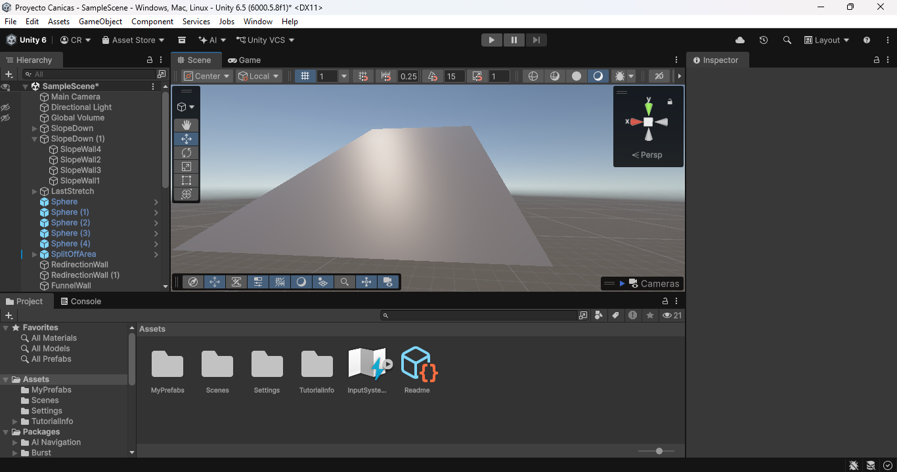
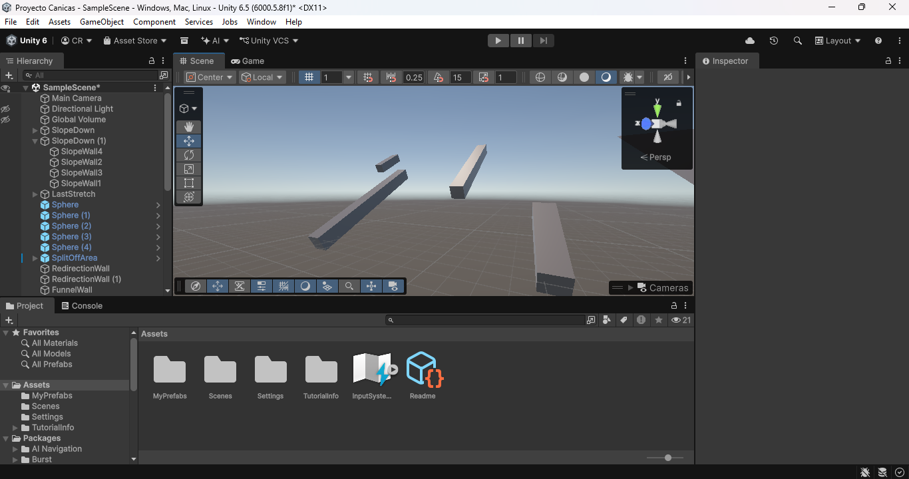
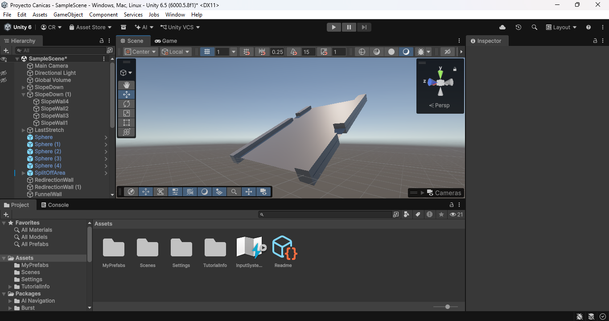
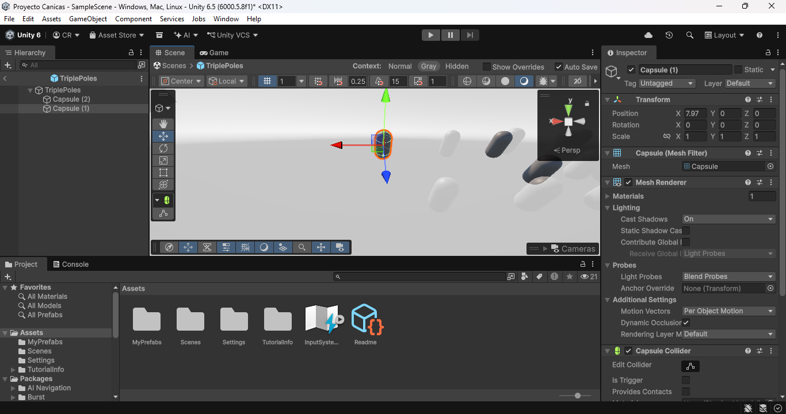
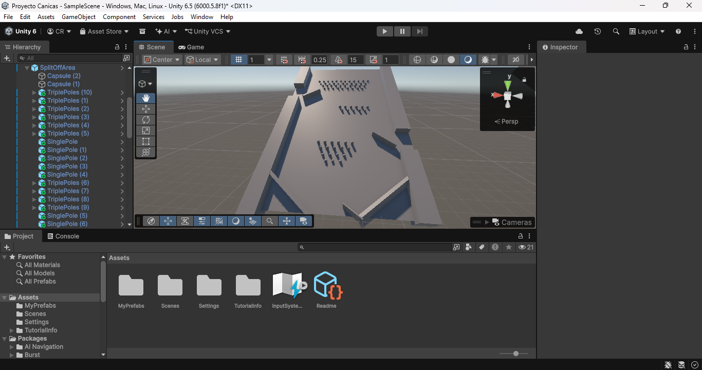
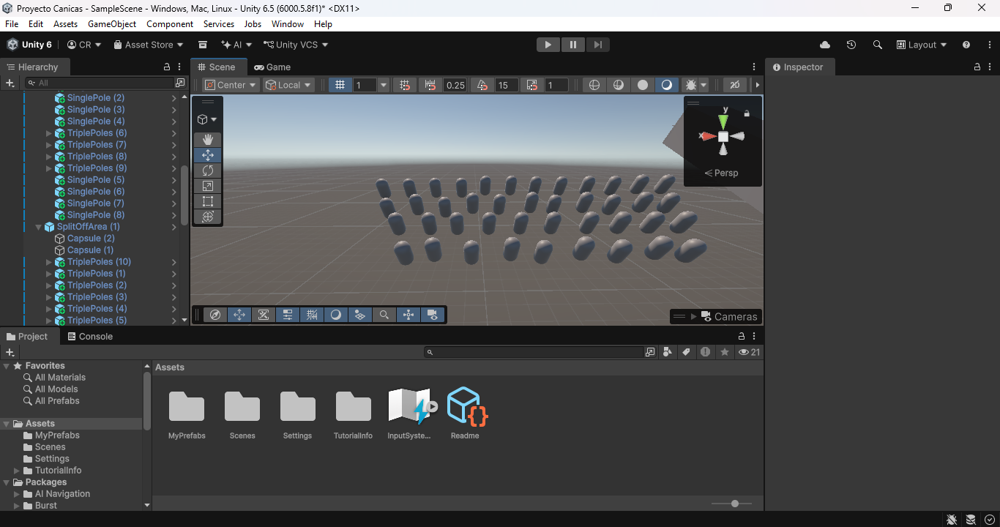

# Proyecto_Canicas
Proyecto_1 CCOM4302 

Participantes

    Christopher Rodriguez Hernandez

    Pablo Alexander Muñoz López

Juego de canicas

1. Creacion de Assets

Camino con inclinacion(Plane)- Ruta por donde iran las canicas

Paredes(Cubos)- Manejar camino de canicas, Estirados para cumplir funcion de pared

Obstaculos(Capsulas)- Desvian canicas a diferentes rutas

 

 

