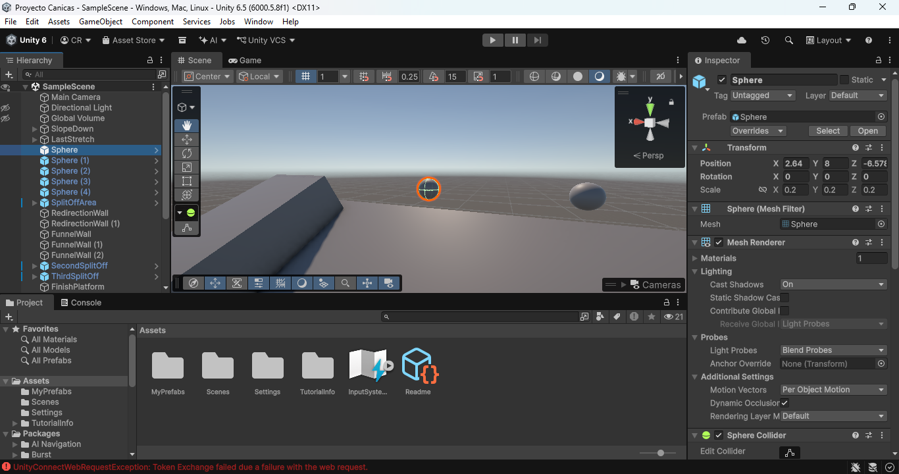

# Proyecto_Canicas
Proyecto_1 CCOM4302 

Participantes

    Christopher Rodriguez Hernandez

    Pablo Alexander Muñoz López

Juego de canicas

1. Creacion de Assets

Canica(Sphere)- La canica será representada por una esfera sin modificar.

**Canica**

Camino con inclinación(Plane)- Ruta por donde irán las canicas, creado con el objeto Plane, con inclinación dirigida hacia abajo para dar impulso a las canicas por medio de la gravedad.

**Camino principal por donde van las canicas**

Paredes(Cubos)- Para manejar el camino de las canicas, creadas a través de la utilización de cubos, manipulando los ejes para cumplir sus funciones deseadas, como altura y ancho.

**Paredes**

**Paredes en el camino**

Obstaculos(Capsulas)- Creadas utilizando cápsulas sin modificar. Su rol es desviar las canicas a diferentes rutas dependiendo de cómo choquen. Al ser utilizadas varias veces, se crearon prefabs para facilitar sus ubicaciones.

**Capsula**
 

**Capsulas organizadas como obstaculos**
 

**Camino principal con obstaculos**

Ruta alterna- Debido a los obstáculos, las canicas se desviarán a rutas alternas para simular un juego de canicas. Con el mismo principio utilizado con el plano y los cubos, se crearon estas rutas alternas para que las canicas pasen.

**Componente de Ruta alterna**

**Rutas alternas organizadas**

Arco Romano- Compuesto de cubos, se divide en una base y los cubos que componen la parte arqueada del arco. A la base se le incrementó la gravedad para mantenerla en su sitio. El resto del arco está compuesto de cubos con ángulos complementarios; con la ayuda de un par de cubos disminuidos, cumplen con el arco del Arco Romano deseado.

**Base del arco romano**
 

**Base con soporte**
 

**Arco romano completado**

**Juego de canica completo**

## 2 - Experiencia obtenida

**Christopher:** Esta ha sido la primera vez que he utilizado Unity, y encontré interesante la manipulación de objetos básicos para crear estructuras. Como ejemplo, los cubos, que se estiraron para crear paredes para parar o guiar las canicas. También encontré novedosa la manipulación de parámetros como la gravedad para forzar comportamientos deseados, como las bases en el Arco Romano.

**Pablo:** En este proyecto aprendí como las físicas de los objetos interactúan entre sí. Los prefabs facilitaron muchísimo la creación de las pistas alternas al no tener que crear cada plataforma una por una. El arco del final estuvo un poco complicado y se tuvo que jugar con los tamaños de los cubos para poder lograr que se mantuviera sin caerse.