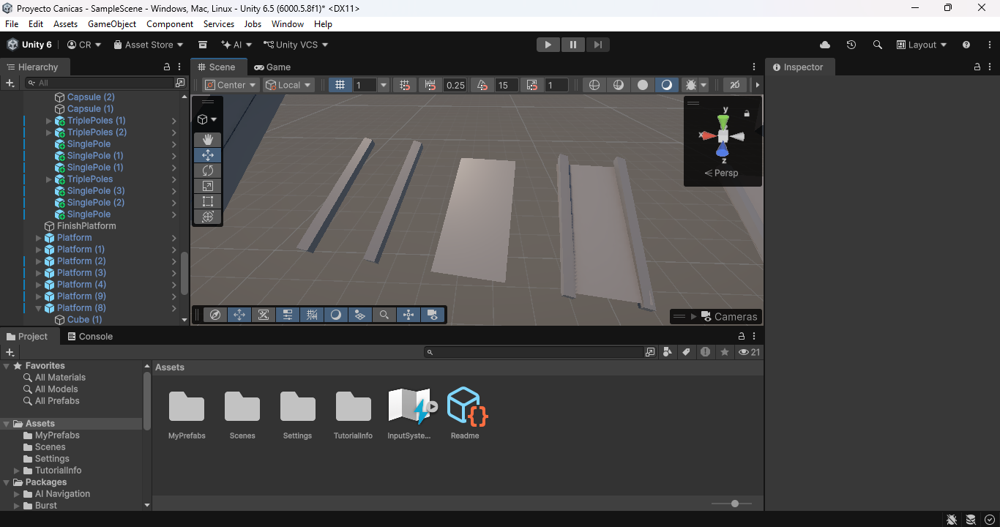
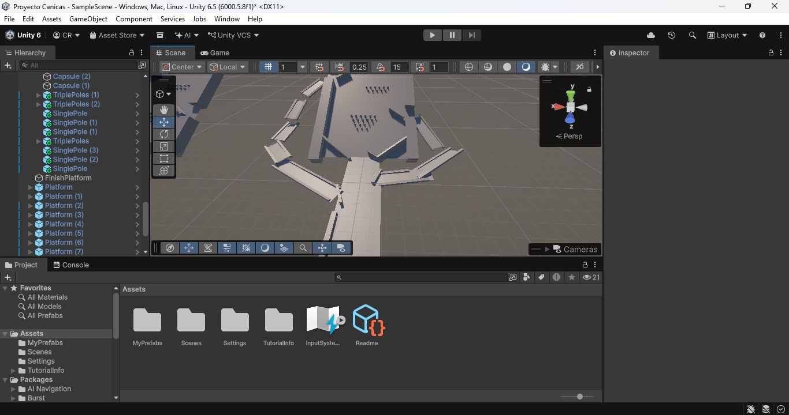
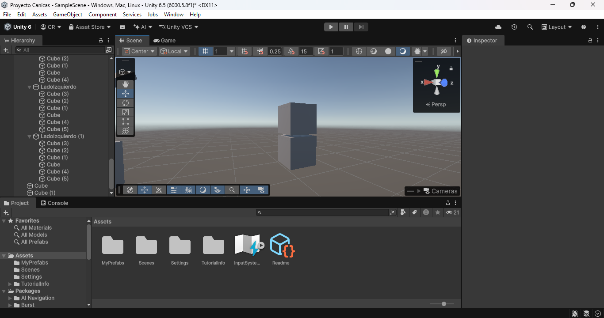
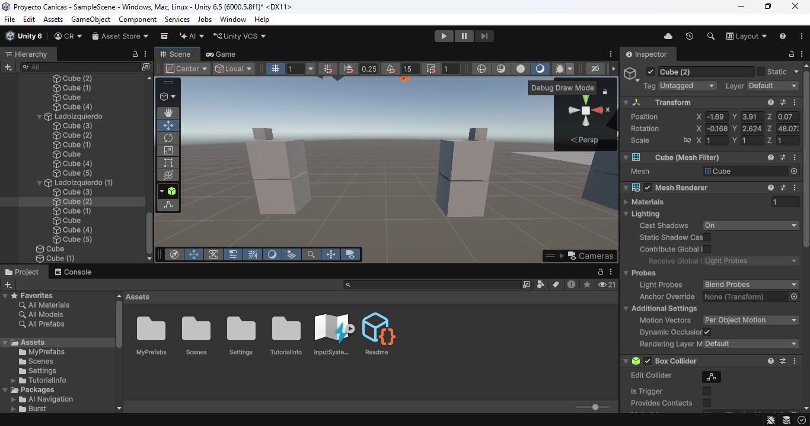
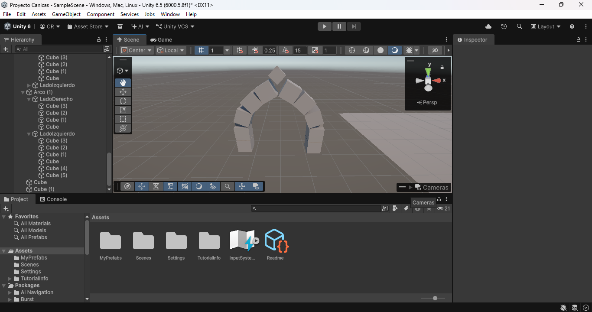
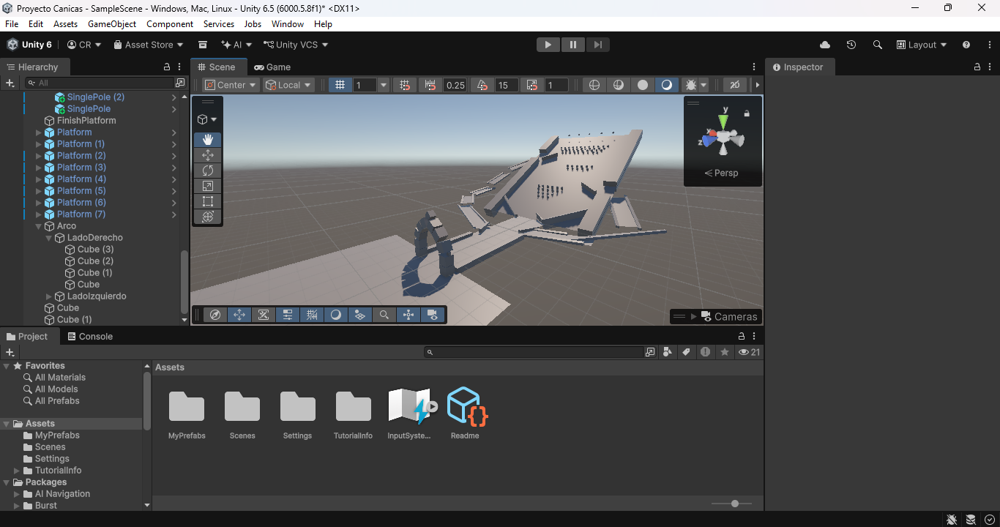

# Proyecto_Canicas
Proyecto_1 CCOM4302 

Participantes

    Christopher Rodriguez Hernandez

    Pablo Alexander Muñoz López

Juego de canicas

1. Creacion de Assets

Camino con inclinacion(Plane)- Ruta por donde iran las canicas

**Camino principal por donde van las canicas**

Paredes(Cubos)- Manejar camino de canicas, Estirados para cumplir funcion de pared

**Paredes**

**Paredes en el camino**

Obstaculos(Capsulas)- Desvian canicas a diferentes rutas

**Capsula**
 

**Capsulas organizadas como obstaculos**
 

**Camino principal con obstaculos**

Ruta alterna

**Componente de Ruta alterna**

**Rutas alternas organizadas**

Arco Romano- Compuesto de cubos, donde las canicas deberian de pasar como desafio, sin tumbarlo

**Base del arco romano**
 

**Base con soporte**
 

**Arco romano completado**

**Juego de canica completo**
